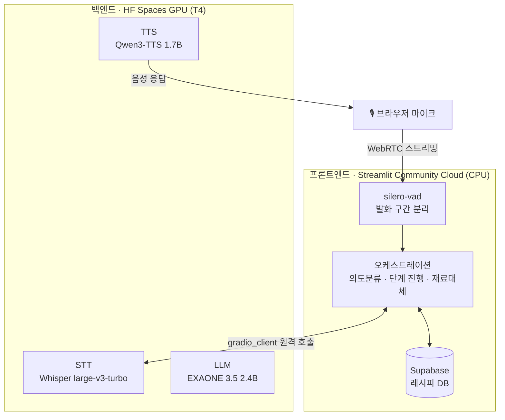

# 👨‍🍳 ChefEar — 손 대신 목소리로 따라가는 레시피 에이전트

요리 초보자가 칼질·반죽처럼 손을 쓰기 어려운 순간에도, 화면을 보지 않고 **음성만으로 레시피를 한 단계씩 진행**할 수 있게 만든 음성 레시피 에이전트입니다. STT·TTS 도메인 파인튜닝과, 실제 레시피 데이터 기반의 대화 흐름 제어를 함께 다룹니다.

> [!NOTE]
> AI Human 7기 1차 팀 프로젝트(3인)의 **2026-08-24 기준 스냅샷**입니다. 팀 원본 저장소에서 함께 만든 코드에, 조장이 프론트엔드/백엔드 분리 배포 작업을 더한 버전이며 이후 개발은 팀 저장소에서 이어졌습니다.

## 👥 팀

| 이름 | GitHub | 역할 | 담당 업무 |
|---|---|---|---|
| 김승욱 (조장) | [@seungwook-kim](https://github.com/seungwook-kim) | 오케스트레이션·통합 | 의도분류, 단계 진행·재료대체 로직, Supabase 검색, HF Spaces 배포 및 통합테스트 |
| 홍민하 | [@minhahamin](https://github.com/minhahamin) | TTS 파인튜닝 / UI | Qwen3-TTS-12Hz-1.7B-VoiceDesign + KSS 학습 환경 구성 및 파인튜닝, Streamlit UI 구현 |
| 하주성 | [@leeony2636](https://github.com/leeony2636) | STT 파인튜닝 | Whisper Small·wav2vec2 비교 실험, openai/whisper-large-v3-turbo QLoRA 파인튜닝, Fixed100/New500 WER·CER 평가 및 최종 STT 모델 선정 |

## 🧭 이렇게 동작해요

```
사용자: "된장찌개 만드는 법 알려줘"
  → 레시피 검색 → 개요 안내 → 시작 여부 확인 → 1단계 안내
사용자: "다음"                         → 다음 단계 안내
사용자: "애호박 없는데 바지락 넣어도 돼?" → 실제 레시피 데이터에서 대체 레시피 검색 → 바뀐 기준으로 진행
사용자: "다시 알려줘"                   → 현재 단계 다시 듣기
요리 완료                              → 바뀐 레시피를 사용자 버전으로 저장
```

| 기능 | 설명 |
|---|---|
| 음성 레시피 조회 | 자유발화를 STT로 받아 의도를 분류하고, 요리명은 로컬 LLM이 추출 |
| 단계별 조리 안내 | 레시피를 한 번에 읽지 않고 한 단계씩 TTS로 안내 |
| 진행 / 재청취 | "다음", "다시", "한 번 더" 등 다양한 표현 인식 |
| 재료 대체 | 조리 중 다른 재료 요청 시 실제 레시피 DB에서 검색해 반영 |
| 사용자 레시피 저장 | 변경한 레시피를 `user_custom`으로 별도 저장 |
| 상시 마이크 | 버튼 없이 계속 듣다가 발화 구간만 잘라 인식 (WebRTC + VAD) |

## 🏗️ 아키텍처

무거운 모델 3개(STT·LLM·TTS)는 GPU 백엔드에서, 화면과 마이크 처리는 무료 프론트엔드에서 돌도록 나눴습니다.



| 구성 요소 | 모델 · 방식 |
|---|---|
| STT | `openai/whisper-large-v3-turbo` QLoRA 파인튜닝(4-bit NF4, r=16, α=64). Whisper Small·wav2vec2와 비교해 선정했고, 배포는 faster-whisper(CTranslate2 int8)로 추론 |
| TTS | `Qwen3-TTS-12Hz-1.7B-VoiceDesign` + KSS 데이터셋 QLoRA 파인튜닝 |
| 요리명 추출 | `EXAONE-3.5-2.4B-Instruct`를 백엔드 GPU에 직접 로드. 불확실하면 지어내지 않고 `None` 반환 |
| 의도 분류 | `jhgan/ko-sroberta-multitask` 임베딩 코사인 유사도 (외부 LLM API 호출 없음) |
| 레시피 데이터 | KADX 만개의 레시피 — 고유 레시피 약 234,538건, 고유 요리명 약 60,282개 (같은 요리명은 조회수 1위를 표준으로 선택) |

## 📊 실측 결과

| 항목 | 결과 | 근거 |
|---|---|---|
| TTS → STT 재인식 CER | **5문장 전부 0.0000** (13에포크 체크포인트) | [`results/tts/roundtrip_cer.csv`](results/tts/roundtrip_cer.csv) |
| TTS 추론 속도 · GPU(RTX 5070) | eager 6.34초 → SDPA 5.48초 → SDPA+`torch.compile(dynamic=True)` **5.21초** (4문장 평균) | [`results/README.md`](results/README.md) |
| TTS 추론 속도 · CPU | 197.48초 → 코드 경로 개선 후 26.11초, 목표(5초) 미달 → **GPU 백엔드로 배포 방향 전환** | [`docs/decisions.md`](docs/decisions.md) #2 |
| 오케스트레이션 테스트 | 단위 테스트 50/50, 실제 Supabase 연결 시나리오 31/31 통과 (2026-08-18) | [`src/orchestration/README.md`](src/orchestration/README.md) |

## 🔧 배포하면서 해결한 문제

| 문제 | 해결 |
|---|---|
| Streamlit Community Cloud(무료, GPU 없음)에서 STT·TTS·LLM을 한 프로세스로 돌릴 수 없음 | 프론트(Streamlit Cloud)와 GPU 백엔드(HF Spaces T4, Gradio)로 분리하고 `gradio_client`로 원격 호출 |
| 상시 마이크가 `Queue overflow`로 끊김 | 원인이 VAD 프레임마다 부르는 `librosa.resample()`(프레임당 18.5ms, 실시간의 92%)임을 실측으로 확인 → `soxr` 직접 호출로 교체해 호출당 0.009ms |
| Gradio 6이 요구하는 `huggingface-hub>=1.16`과 `transformers==4.57.3`(`<1.0` 요구)이 양립 불가 | 두 요구사항의 교집합에 들어가는 Gradio 5.49.0으로 고정 |
| `streamlit-webrtc`가 끌어오는 `aiortc`와 `av==18.1.0` 의존성 충돌 | `aiortc`가 허용하는 `av==17.1.0`으로 고정 |
| VAD가 발화 중 상태에서 풀리지 않거나 로딩바가 무한히 남는 경우 | 15초 VAD 강제 리셋, 45초 로딩 타임아웃 안전장치 추가 |

## 📁 구조

```
.
├── src/
│   ├── app.py              # Streamlit 엔트리포인트 (프론트엔드)
│   ├── orchestration/      # 의도분류 · 레시피 검색 · 재료대체 · 등록 · 파이프라인
│   ├── stt/  tts/  llm/    # 모델별 추론 코드
│   └── ui/                 # 화면 · 세션 · 상시 마이크(voice_io)
├── hf_backend/             # GPU 백엔드 (Gradio API)
├── db/                     # Supabase 스키마
├── results/                # 평가 결과 CSV
├── tests/                  # pytest · 통합 시나리오
└── docs/                   # PRD/SDD · 설계서 · 결정 기록 · 기능 Spec
```

## ▶️ 실행

```bash
# 프론트엔드 (백엔드 Space는 HF_BACKEND_SPACE=<계정>/<space-이름> 환경변수로 지정)
pip install -r requirements.txt
streamlit run src/app.py

# GPU 백엔드 (로컬 GPU 필요)
pip install -r hf_backend/requirements.txt
python hf_backend/app.py
```

`SUPABASE_URL`/`SUPABASE_KEY`가 없으면 자동으로 mock DB로 동작합니다. 로컬에서 STT·TTS·LLM을 한 프로세스로 돌릴 때는 `requirements-main.txt`를 사용합니다.

## ⚠️ 한계

- 백엔드가 유료 GPU(T4)를 전제로 해서 상시 공개 데모는 운영하지 않습니다.
- TTS 응답 속도는 짧은 문장 기준으로 목표(5초)에 근접했지만, 긴 문장이 섞이면 평균이 다시 늘어납니다.

## 📚 문서

[PRD/SDD v0.8](docs/ChefEar_PRD_SDD_v0.8.md) · [설계서(PDF)](docs/ChefEar_설계서.pdf) · [결정 기록](docs/decisions.md) · [경쟁사 분석](docs/ChefEar_경쟁사분석.md) · [기능 Spec](docs/specs)
